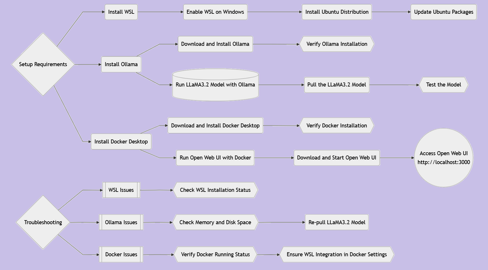
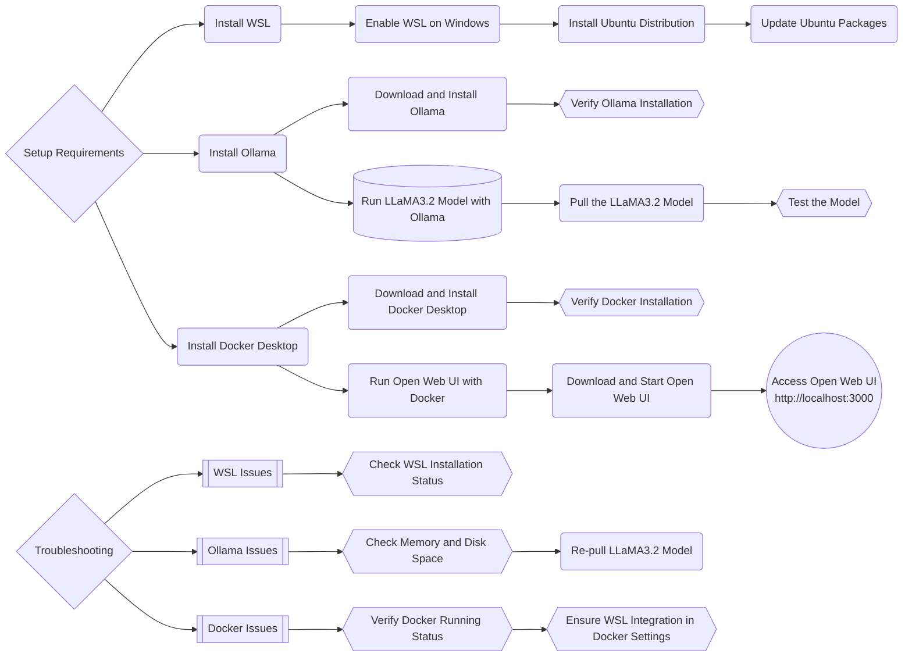

# Setting Up WSL, Ollama, and Docker Desktop on Windows with Open Web UI
##  Workflow Summary

<details>
<summary></summary>


</details>
This guide provides a step-by-step process to set up essential tools for running advanced AI models and applications. Ensure your machine meets the following minimum requirements:

-   **Memory**: At least 16GB (32GB or 64GB recommended)
-   **Storage**: At least 40GB of free disk space
-   **Processor**: 12th generation Intel i7 or equivalent (GPU recommended for optimal performance)

----------

## Step 1: Install Windows Subsystem for Linux (WSL)

### 1.1 Enable WSL on Windows

1.  Open **PowerShell** as Administrator.
2.  Run the following command to enable WSL:
    
    ```powershell
    wsl --install
    
    ```
    
3.  Restart your computer if prompted.

### 1.2 Install Ubuntu Distribution

1.  Open **Microsoft Store** and search for "Ubuntu".
2.  Select the desired version (e.g., Ubuntu 22.04) and click **Install**.
3.  Once installed, launch Ubuntu from the Start menu and follow the setup process (create a username and password).

### 1.3 Update Ubuntu Packages

In the Ubuntu terminal, update the package list:

```bash
sudo apt update && sudo apt upgrade -y

```

----------

## Step 2: Install Ollama on Windows

### 2.1 Download and Install Ollama

1.  Visit the [Ollama Website](https://ollama.ai/).
2.  Download the Windows installer and run it.
3.  Follow the installation prompts.

### 2.2 Verify Ollama Installation

Open Command Prompt or PowerShell and type:

```powershell
ollama --version

```

You should see the installed version of Ollama.

----------

## Step 3: Run LLaMA3.2 Model with Ollama

### 3.1 Pull the LLaMA3.2 Model

In Command Prompt or PowerShell, run:

```powershell
ollama pull llama3.2

```

### 3.2 Test the Model

Run the following command to test the model:

```powershell
ollama run llama3.2

```

You should see the model respond to your input.

----------

## Step 4: Install Docker Desktop on Windows

### 4.1 Download and Install Docker Desktop

1.  Visit the [Docker Desktop Website](https://www.docker.com/products/docker-desktop/).
2.  Download the Windows installer and run it.
3.  During installation, choose **WSL 2** as the backend.
4.  Complete the installation and restart your computer if prompted.

### 4.2 Verify Docker Installation

Open PowerShell and type:

```powershell
docker --version

```

You should see the installed Docker version.

----------

## Step 5: Run Open Web UI with Docker

### 5.1 Start the Open Web UI

Run the following command to download and start the UI:

```bash
docker run -d -p 3000:8080 --add-host=host.docker.internal:host-gateway -v open-webui:/app/backend/data --name open-webui --restart always ghcr.io/open-webui/open-webui:main

```

### 5.2 Access the Open Web UI

1.  Open your browser and go to: [http://localhost:3000](http://localhost:3000)
2.  You should see the Open Web UI interface ready to use.

----------

## Troubleshooting

### WSL Issues

-   Ensure WSL is installed properly by running:
    
    ```powershell
    wsl --list --verbose
    
    ```
    

### Ollama Issues

-   If the LLaMA3.2 model fails to load, ensure you have enough memory and disk space.
-   Re-pull the model if there’s a digest mismatch:
    
    ```powershell
    ollama pull llama3.2
    
    ```
    

### Docker Issues

-   Verify Docker is running with:
    
    ```powershell
    docker info
    
    ```
    
-   Ensure WSL integration is enabled in Docker Desktop settings.

----------

With these steps, you’ll have a powerful environment ready for AI model experimentation and development. Enjoy exploring!